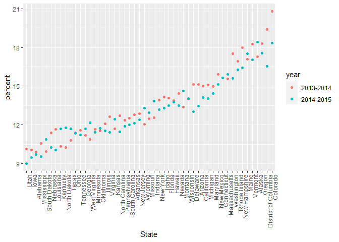

stringfactor
================
Shun Xie
2022-10-18

``` r
library(rvest)
library(p8105.datasets)
library(tidyverse)
```

    ## ── Attaching packages ─────────────────────────────────────── tidyverse 1.3.2 ──
    ## ✔ ggplot2 3.3.6      ✔ purrr   0.3.4 
    ## ✔ tibble  3.1.8      ✔ dplyr   1.0.10
    ## ✔ tidyr   1.2.0      ✔ stringr 1.4.1 
    ## ✔ readr   2.1.2      ✔ forcats 0.5.2 
    ## ── Conflicts ────────────────────────────────────────── tidyverse_conflicts() ──
    ## ✖ dplyr::filter()         masks stats::filter()
    ## ✖ readr::guess_encoding() masks rvest::guess_encoding()
    ## ✖ dplyr::lag()            masks stats::lag()

## String vectors

``` r
string_vec = c("my", "name", "is", "jeff")
str_detect(string_vec, "jeff")
```

    ## [1] FALSE FALSE FALSE  TRUE

``` r
str_detect(string_vec, 'm')
```

    ## [1]  TRUE  TRUE FALSE FALSE

It finds if the element is in the string

Replacement:

``` r
str_replace(string_vec,"jeff","Jeff")
```

    ## [1] "my"   "name" "is"   "Jeff"

``` r
string_vec = c(
  "i think we all rule for participating",
  "i think i have been caught",
  "i think this will be quite fun actually",
  "it will be fun, i think"
  )
str_detect(string_vec, "i think")
```

    ## [1] TRUE TRUE TRUE TRUE

``` r
str_detect(string_vec, "^i think") #regular expression, start with i think
```

    ## [1]  TRUE  TRUE  TRUE FALSE

$^\text{I think}$ is the expression that only find the sentence begin
with I think.

``` r
string_vec = c(
  "Y'all remember Pres. HW Bush?",
  "I saw a green bush",
  "BBQ and Bushwalking at Molonglo Gorge",
  "BUSH -- LIVE IN CONCERT!!"
  )

str_detect(string_vec,"[Bb]ush")
```

    ## [1]  TRUE  TRUE  TRUE FALSE

``` r
str_detect(string_vec, "[Bb][Uu][Ss][Hh]")
```

    ## [1] TRUE TRUE TRUE TRUE

\[Bb\] either B or b is fine

``` r
string_vec = c(
  '7th inning stretch',
  '1st half soon to begin. Texas won the toss.',
  'she is 5 feet 4 inches tall',
  '3AM - cant sleep :('
  )
str_detect(string_vec, "^[0-9][a-zA-Z]")
```

    ## [1]  TRUE  TRUE FALSE  TRUE

“[^1]\[a-zA-Z\]” start with number followed by a letter

``` r
string_vec = c(
  'Its 7:11 in the evening',
  'want to go to 7-11?',
  'my flight is AA711',
  'NetBios: scanning ip 203.167.114.66'
  )

str_detect(string_vec, "7.11")
```

    ## [1]  TRUE  TRUE FALSE  TRUE

In re, a dot means you can put anything (:,-,.,etc) that in the dot
position.

``` r
string_vec = c(
  'The CI is [2, 5]',
  ':-]',
  ':-[',
  'I found the answer on pages [6-7]'
  )

str_detect(string_vec, "\\[")
```

    ## [1]  TRUE FALSE  TRUE  TRUE

``` r
str_detect(string_vec, "\\[[0-9]") # a character [ followed by a number.
```

    ## [1]  TRUE FALSE FALSE  TRUE

search for a special character: use \\

Why factors are weird

``` r
factor_vec = factor(c("male", "male", "female", "female"))

as.numeric(factor_vec)
```

    ## [1] 2 2 1 1

``` r
#change the order
factor_vec = fct_relevel(factor_vec, "male")
as.numeric(factor_vec)
```

    ## [1] 1 1 2 2

# NSDUH

Revisit an example:

``` r
nsduh_url = "http://samhda.s3-us-gov-west-1.amazonaws.com/s3fs-public/field-uploads/2k15StateFiles/NSDUHsaeShortTermCHG2015.htm"

table_marj = 
  read_html(nsduh_url) %>% 
  html_table() %>% 
  first() %>%
  slice(-1) 
```

Tidy up the NSDUH data …

``` r
data_marj = 
table_marj %>% 
  select(-contains("P value")) %>% #remove any columns with P value 
  pivot_longer(
    -State, #everything except for state
    names_to = "age_year",
    values_to = "percent"
  ) %>% 
  mutate(
    percent = str_replace(percent, "[a-b]$", ""), #any value end with a-b 
    percent = as.numeric(percent)
  ) %>% 
  separate(age_year, into = c("age","year"), sep = "\\(" ) %>% 
  mutate(
    year = str_replace(year,"\\)", ""),
    percent = str_replace(percent, "[a-c]$", ""),
    percent = as.numeric(percent)) %>%
  filter(!(State %in% c("Total U.S.", "Northeast", "Midwest", "South", "West")))
```

``` r
data_marj %>%
  filter(age == "12-17") %>% 
  mutate(State = fct_reorder(State, percent)) %>% 
  ggplot(aes(x = State, y = percent, color = year)) + 
    geom_point() + 
    theme(axis.text.x = element_text(angle = 90, hjust = 1))
```

<!-- -->

[^1]: 0-9
